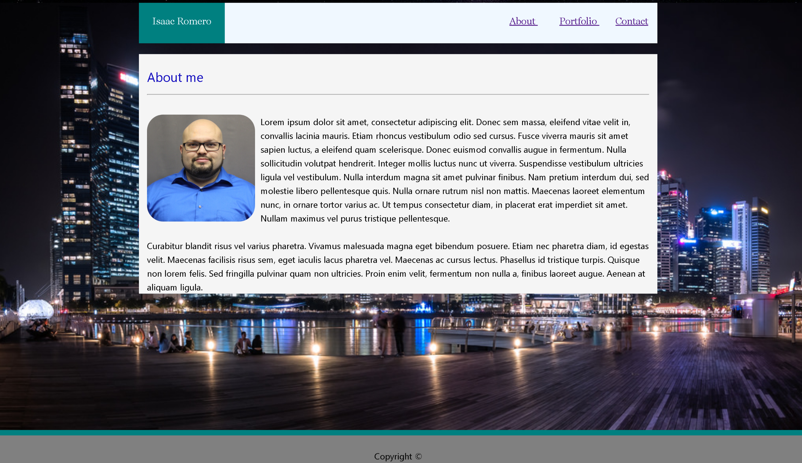
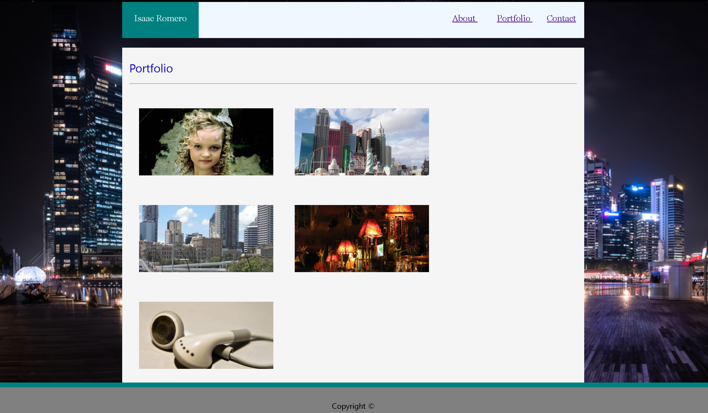
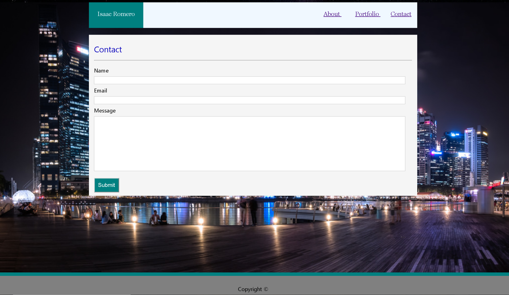

<h1> Basic Portfolio </h1>

<h2> Instructions</h2>

Created a basic portfolio using no pre build framworks. This Portfolio contains 3 pages: about me , portfolio and contact. Ambout me is design to contain a brief summary on the individuals portfolio. Portfolio page contains a layout of different projects. And contact is a messaging section for contacts. There are no projects linked to this portfolio neither does the contact page work. 

<a href="http://awsportfolio-20181202184005--hostingbucket.s3-website-us-west-2.amazonaws.com/">For my portfolio click here</a>

<h2> Tech used </h2> 

This porfolio template was created using html and css only. It is statics. No functunally has been added to any pages and contact system is no operational. 

<h2> Future Developments </h2> 

* no future developments at this time

<h2 > Front End </h2> 
<h3>About me </h3>

<h3>Portfolio</h3>

<h3>Contact </h3>
